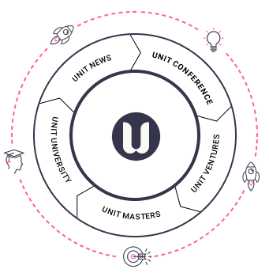

# 🌎 Ecosystem DAOs

## Overview

**At the heart of the Unit Network ecosystem are a series of free initiatives designed to help educate, accelerate and onboard individuals, communities and companies from all over the world.**

In addition to the primary Unit Network application, there are several other initiatives setup by the core team to aid education and adoption of tokenisation, blockchain technology and cryptocurrency.

Our initiatives flywheel has the acronym C.V.M.U.N which stands for **Conferences, Ventures, Masters, University,** and **News**. Each of the five initiatives acts as growth channel for Unit Network by driving adoption and providing expert support to those looking for new solutions in the world of Web3.

<figure><figcaption>
Unit Initiatives Flywheel
</figcaption></figure>


Each Initiative (C.V.M.U.N) has a mandate and a dedicated team managed by one or more Unit Core Team members that coordinate and support achievement of the protocol’s key goals.


### **C.V.M.U.N. | External education & growth initiatives**

* Unit Events**:** A community led, bi-annual series of Crypto, City and Industry forums held online in TedX style format. Create forums to inform, engage, inspire about the token economy in respective ecosystems, cities, industries.&#x20;
* Unit Ventures: A 6 week tokenisation accelerator program helping individuals and business to build their own Token economies. Supporting DAOs to successfully launch their token projects and maintain growth through sound business models.&#x20;
* Unit Education A free 6 week education program focused on the fundamentals of blockchain, cryptocurrencies and tokenisation. Providing basic blockchain education about the token economy in a barrier free and engaging way.&#x20;
* Unit Media: A knowledge resource for the Token economy with updated papers and articles covering projects + people. Creating data-driven research that sheds lights on merits and challenges for the value-based token economy.
* Unit Content: Daily news, interviews and updates from the wider crypto ecosystem and the Unit Token economy. Providing information feeds about new token and product releases in Unit Network for the entire ecosystem.

Unit Tokens

An overview of the fundamental tokens and how Unit Network categories tokens.

## Overview:

**With Unit Network, we aim to create impactful connections throughout communities and marketplaces built on a cooperative economy using tokens**.This is a world where whichever city you go into, whatever industry you work in or whatever dream you want to bing to life you can easily plug into an ecosystem to collaborate with and support other like minded individuals, businesses and communities.&#x20;

**We believe tokens and the features offered on Unit Network play a key role in helping establish this vision of the future.**

**Additionally, in our effort to reduce speculative token valuations and improve adoption, each type of coin or token has a slightly different role within our ecosystem.** This is important to understand on your journey into cryptocurrencies and Web3 as **not all coins or tokens are made equal**, just in the same way that not all communities or clubs are equal in what they offer.&#x20;

Understanding the fundamentals of each kind of token will help you better navigate this emergent space and get you prepared to [launch your own token](unit-ventures.md) as well.&#x20;

<figure><figcaption></figcaption></figure>
