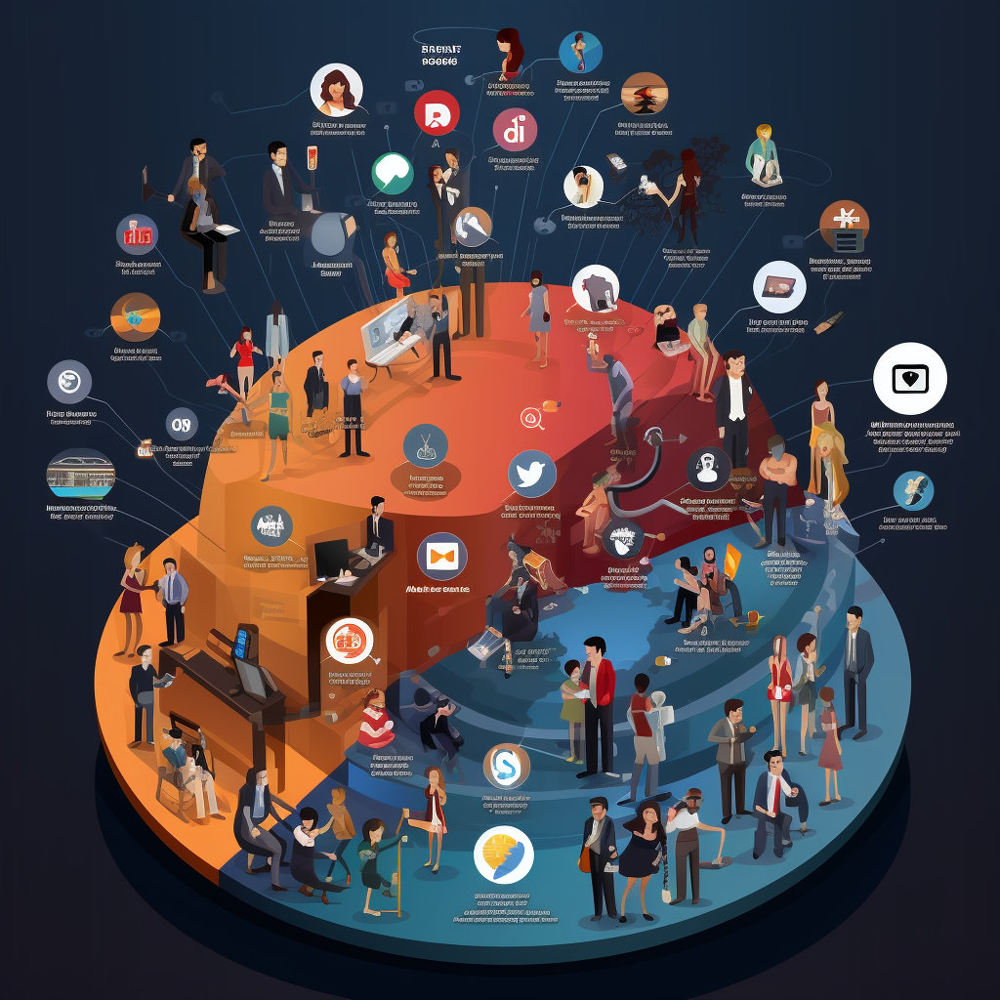

# 📽 Unit Content

## Overview

Our DAO is the place to learn about content creation and has everything you need to stay ahead of the curve in the world of social media.

Due to our network of influencers and top tier publicists we can ensure fast growth and support our clients to build an engaging community. Our goal is to make our clients master the full range of skill sets to create content pieces with the potential to go viral and bring their publications to the next level.

We are breaking down the complexity and different elements of social media to an easy and understandable level, which makes us unique in the space. Everything is designed to cover all relevant social media platforms.\
\
We look forward to growing and evolving alongside our clients as we continue to explore the exciting world of social media.

<figure><figcaption></figcaption></figure>

 

<figure><figcaption></figcaption></figure>

 

<figure><figcaption></figcaption></figure>

## Services & Products

1. We are connecting our clients with influencers and tier 1 publicists by finding relevant synergies for collaborations in order to enhance the clients growth.
2. We offer an overall package including a variety of courses with the option to book them separately. The courses are covering all important social media topics like: content strategy, scripting, video recording / editing & social media marketing (...).
3. We support influencers to tokenize their channels and communities on Unit Network.

## Our Vision

We all observed how the importance of a good **social media presence** has increased in the last few years, which makes it one of the **strongest marketing tools** for companies and individuals. We believe that the importance will continue to rise so that there will be no successful company or brand without a good social media presence. The Unit Network $CONTENT DAO will play a major role in making that happen.

## Team

Our team consists of experienced brand developers, marketing experts, and skilled content creators who are passionate about sharing their insights with our clients.

**Members:** \
\
Mario Gregor (team lead, professional video and post editor, analytic specialist, brand developer)&#x20;

Thorne Davis (professional musician, content creator, designer)

## Join Us!

We are building a space for our community to support each other, share their experiences and perspectives on the latest developments in the world of content creation.&#x20;

Here is the current list of all official communication and social media channels. Please ensure you are following the correct handles as scam / fake accounts sometimes circulate.

### Community Chat

[Telegram](https://t.me/unitnetwork) (This is the primary communication channel)->

[Discord](https://discord.com/invite/unitnetwork) ->

[Forum](https://forum.unit.network/) ->

### Social Media

[Twitter](https://www.twitter.com/theunitnetwork) ->&#x20;

[Instagram](https://instagram.com/unitnetwork) ->

[YouTube](https://www.youtube.com/c/UnitGlobal/featured) ->

[TikTok](https://tiktok.com/@unitnetwork) ->

[Reddit](https://www.reddit.com/r/unitnetwork/) ->

### News & Articles

[Medium](https://unitnetwork.medium.com/) ->

[Unit News](https://news.unit.network/) ->

[Unit University](https://university.unit.network/) ->

### Developer

[GitHub](https://github.com/unit-network) ->

