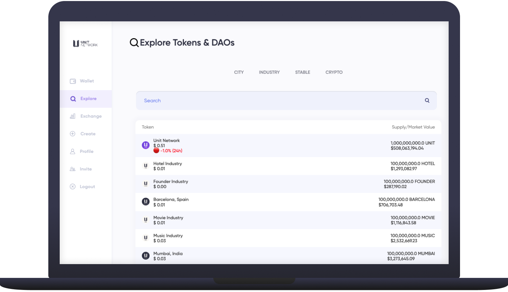
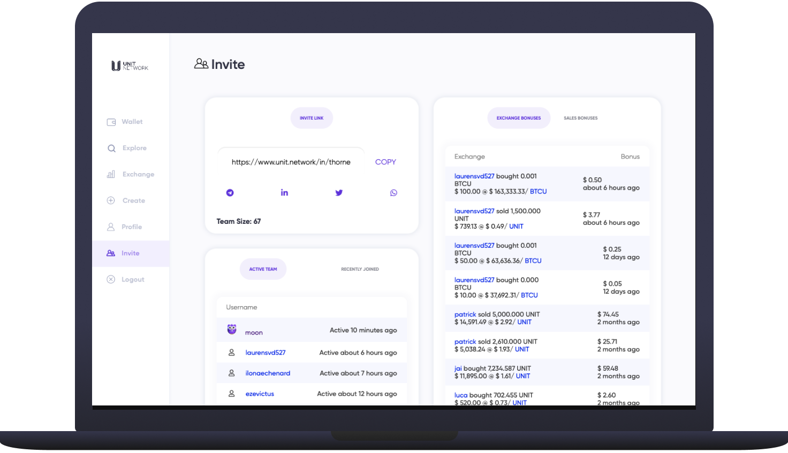

# 🌐 Quick Start

### Step 1: Register

To open an account on Unit Network you will need a [referral link / invite URL](broken-reference) from an existing user. If you don't know an existing user try asking around on any of our social media channels.


**All usernames on Unit Network must be unique.** Once registered, it's recommended to personalise your username (whether public or pseudonymous) via _Profile / Settings / Username_ as transfers, chat, whitelisting, teams etc. all function on a username basis.&#x20;


<figure><figcaption></figcaption></figure>

### Step 2: Deposit / Buy Crypto

Depositing your crypto to Unit Network can be done via the [Deposit](https://www.unit.network/wallet/deposit) tab of your user wallet. Note some deposits may take a few hours to confirm.


**Important!** Do not send your crypto to Unit Network via a centralised exchange like [Binance](https://www.binance.com/en), [Coinbase](https://www.coinbase.com/) etc. The crypto must arrive from a self-custodial wallet like [Ledger](https://www.ledger.com/), [Trezor](https://trezor.io/), [MetaMask](https://metamask.io/), [Exodus](https://www.exodus.com/) etc. so the transaction can be verified.&#x20;


If you do not already have crypto you can purchase Bitcoin with your debit / credit card through [Moonpay](https://www.moonpay.com/) via '_Wallet / Deposit'_ tab. Users who do not have an account with [Moonpay](https://www.moonpay.com/) will need to create one which takes about 10mins to complete with KYC confirmation. For more information [see the complete depositing documentation here. ](../../technology/key-features/wallet/wallet-2.md)

<figure><figcaption></figcaption></figure>

### Step 3: Explore

Find DAOs and tokens via the 'Explore' tab. Selecting a token will show a dashboard with options to trade, stake, buy and review the all the tokens information.&#x20;


**Keep an eye on token treasuries!** If there's nothing in the treasury, the token value is speculative with no clarity on downside risk**.** Crypto sent to a token treasury can only be redeemed by token holders who may send tokens back to the treasury (burning the tokens) to receive a relative portion of the value held. This sets a floor price and mitigates risk for token holders.


<figure><figcaption></figcaption></figure>

### Step 4: Grow your token portfolio

There are a few important incentives build into the platform that all users can make use of if the choose to.

* Share your invite link and earn 0.5% of all trades your referrals make [Read more](broken-reference)
* Stake your tokens in liquidity pools to earn up to 0.5% of the trades [Read more](broken-reference)
* Bond stake your UNIT for up to 15% APY [Read more](../../technology/core-apps/wallet.md)
* Lock your UNIT in the Vaults to take out crypto loans [Read more](../../technology/key-features/wallet/exchange.md)

<figure><figcaption></figcaption></figure>

### Step 5: Join our community channels

For weekly updates, discussion with like minds and everything else tokenisation be sure to follow:

* [Telegram](https://t.me/unitnetwork)
* [Twitter](https://twitter.com/theunitnetwork)
* [Discord](https://discord.com/invite/unitnetwork)
* [Instagram](https://www.instagram.com/unit.network)
* [LinkedIn](https://www.linkedin.com/in/theunitnetwork)
* [YouTube](https://www.youtube.com/unitglobal)
