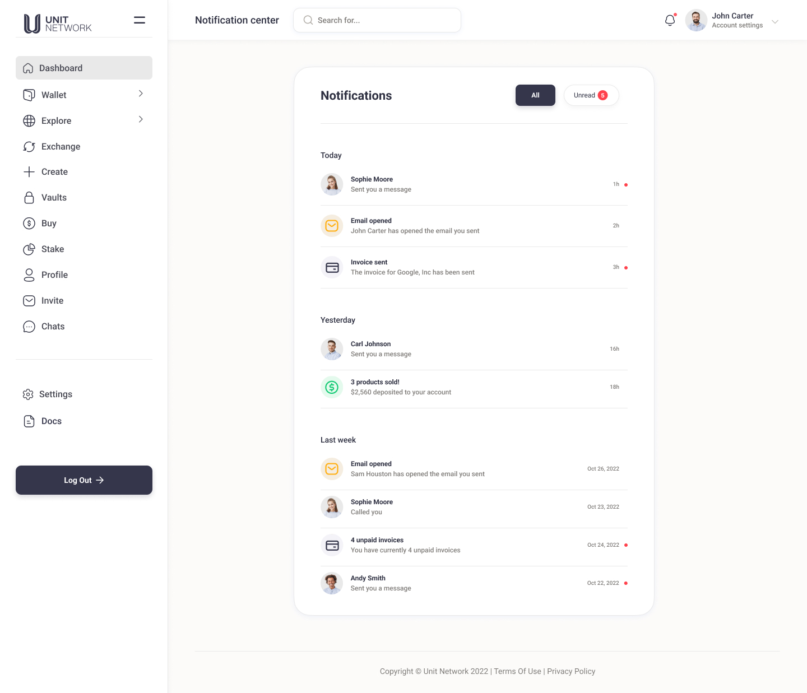

# 🛣 Timeline

Timeline - Information on the timeline for Unit Ventures separated into five phases.

## Overview:

Our project timeline identifies the end goal as being the adoption of the token economy for the mainstream. The pathway is to build the UNIT token economy and build 50 industry token economies and 50 city token economies that ignite the future of the cooperative stakeholder economy.

#### Phase 1: Research and Development - 2017-2019

* In this phase, the initial co-founders focused on conducting market research to understand the requirements and challenges of decentralised technologies and various implementations that could improve wealth distribution and better leverage existing value locked in crypto ecosystems
* Began prototyping and testing different technical approaches to ensure that our application would be reliable, scalable, and user-friendly.&#x20;
* Decided on a purpose built blockchain created with Substrate, deployed on Polkadot's relaychain

#### Phase 2: MVP Launch & Team Growth - 2019-2020

* Based on the insights gathered in phase 1, we developed a minimum viable product (MVP) of our Web3 application and began beta testing
* The MVP will included the core features and functionality that were necessary for our application to provide value to users
* Iteration based on user feedback and better understanding of use-case requirements
* Launched Unit Masters and Unit Conferences

#### Phase 3: Feature Set Ideation, Development & IDO - 2020-2021

* Continued to gather feedback from users and incorporated it into the product development
* Expanded platform functionality and capabilities while exploring potential partnerships and integrations
* Launched on Rococo test-net (Polkadot test network)&#x20;
* Developed Vaults concept to distribute asset management and facilitate decentralised wrapping / unwrapping
* Initiated UNIT token IDO
* Scaled Unit Conference and Unit Masters to over 10,000 participants and graduates
* Scaled core team to build out the C.V.M.U.N & M.O.P.S frameworks and improve marketing efforts

#### Phase 4: Core Feature Development, Team Expansion & Private Sales - 2021-2022

* Platform gained more users and traction with over 44k user wallets created
* Prioritised bug fixes, performance and reliability.
* Launched UNIT and user token DEX's
* Initiated UNIT & USDU rebase
* Attended, sponsored and presented at 54 conferences and events around the world
* Over 10,000 graduates through the Unit Masters program
* Launched the Unit Ventures accelerator program
* Created Alpha Network as canary chain to launch on Kusama
* Prepared to deploy on Polkadot relay-chain
* Community features close to complete
* Private sale round pricing adjusted
* UI / UX v2 underway to incorporate with updated tech stack

#### Phase 5: Core Feature Launch & Parachain Deployment - 2023 - 2024

* UNIT Bond Staking <mark style="color:green;">**(Live)**</mark>
* User token bond staking <mark style="color:green;">**(Live)**</mark>
* Default community features <mark style="color:yellow;">**(Final stages)**</mark>
* Vaults <mark style="color:yellow;">**(Final stages)**</mark>
* Withdrawals <mark style="color:orange;">**(In progress)**</mark>
* Blockchain development <mark style="color:orange;">**(In progress)**</mark>
* Parachain deployment <mark style="color:orange;">**(In progress)**</mark>
* UI/UX v2 <mark style="color:orange;">**(In progress)**</mark>
* Withdrawals / Deposits <mark style="color:orange;">**(In progress)**</mark>
* In-app token gating <mark style="color:orange;">**(In progress)**</mark>
* Bridging to other ecosystems outside Polkadot relaychain <mark style="color:red;">**(Preparation)**</mark>
* Cross-chain communication with other Parachains <mark style="color:red;">**(Preparation)**</mark>
* Self-custodial wallets <mark style="color:red;">**(Preparation)**</mark>
* Community feature SDK <mark style="color:red;">**(Preparation)**</mark>
* Updated documentation / video tutorials <mark style="color:red;">**(Preparation)**</mark>

## Overview

As we enter the first quarter of 2023, the Unit Network core team would like to update the community on a series of important product developments we’ve been working on. These bridge a number of categories including: Blockchain development and parachain deployment, UI/UX improvements, community features, self-custody and interoperability with other ecosystems.&#x20;

We’ve been hard at work on delivering the necessary updates for these features and upgrades and look forward to having them live. With this is mind we also ask for patience, understanding and support from the Unit Network community as some updates may take longer than expected. &#x20;

Due to the operational model and UNIT token sale structure (90% of all funds raised locked into the treasury) **all core team members operate as co-founders, take no salary and self-fund all efforts towards building the Unit Network ecosystem.** We operate with an incredibly low burn-rate and can continue to build during poor market conditions. While our progress may seem slower than other projects in the space we strongly believe this approach ensures the longterm success of the project moving forward and builds an aligned community along the way.

Web3 technology has the potential to revolutionise the way we interact with the internet and build communities, companies and currencies. The Unit Network team is excited to be at the forefront of this movement building what we believe will be the Web3 operating system of the future.&#x20;


This roadmap is dynamic and may adjust overtime based on a variety of factors. With that said, the outline below details what updates and improvements are closest to being complete and of the highest priority.


## Product Roadmap:

### Q1 2023: Core Feature Completion & Parachain Preparation

#### 1. Community Features

We are close to completing a suite of on-chain community features for token creators to reward, monetise, interact and engage with their communities. These features are simple to use but powerful in their application. Some of these features are already live but work is underway to have the entire suite live before the end of February 2023.&#x20;


We are looking closely at creating an SDK (Software Development Kit) that will allow other developers and community members to create their own community features or dApps that can plug into Unit Network, creating an app store of sorts that greatly enhances the tools available to token creators and communities.


#### 2. Bond Staking

Bond staking rewards for UNIT will be fixed at 10% APY with a 200m UNIT pool and a 28 day unbonding period. Based on this, the more users that stake the faster the pool will diminish vs. a variable rate schedule which reduces staking rewards based on a higher number of users staking.

* Tokens claimed from bond staking rewards will be immediately sent to a users wallet
* Users are able to unbond any amount of their total tokens staked at any time which will be subject to a 28 day unbonding period
* Users are able to cancel any unbonding requests within the 28 day period, though they will not be awarded any of the potential UNIT that could have been earned during that time
* Users will be able to claim the bond staking rewards daily and re-stake for compounding returns


Bond staking will also be available for all tokens created on Unit Network. The token administrator will be able to set the fixed APY from 1-30% and specify unbonding period from 0-28 days. Any user may also add additional tokens to a bonding pool if they choose.


#### 3. Vaults&#x20;

The Vaults distribute asset management while facilitating wrapping (deposits) and unwrapping (withdrawals) of tokens on Unit Network. This represents a huge step towards the protocol's decentralisation and will also mark the first important step toward live withdrawals from Unit Network. The Vaults are a cornerstone innovation of the Unit Network operating system and have no margin for error. As such, the Vaults will undergo thorough testing and a staged rollout:

1. The complete Vault mechanism will be tested internally, until perfectly sound
2. All Vault stakers will be required to check and ensure access to their trusted wallet addresses. **Cold storage devices like Ledger or Tezor are highly recommended**
3. Small test distributions will be made to Vault staker addresses&#x20;
4. Remaining digital assets held will be distributed incrementally to Vault stakers
5. Deposits to Vault addresses will be enabled
6. Withdrawals processed by Vault stakers will be enable

#### 4. Withdrawals

With withdrawal processes live through the Vaults, additional liquidity can begin to fill up the crypto exchange pools (BTCU, ETHU, DOTU) providing arbitrage opportunity for traders and a more vibrant marketplace for the wider community as value can flow freely.&#x20;

* All withdrawals will incur a 1% fee (0.5% to the Vault staker processing the withdrawal & 0.5% to the UNIT Treasury) which will be competed for by the various vault stakers.&#x20;

#### 5. Parachain Preparation

We are preparing to launch our canary network (Alpha Network) on Kusama which will be where all new updates and features are tested before getting pushed to primary chain (Unit Network) on Polkadot. In preparation for deployment we are making important improvements to the tech-stack while growing the development team to expedite the processes. With an updated codebase, the parachain bids will take place in the following stages:

1. Complete codebase updates, migrating to Rust & React
2. Security audits and penetration testing
3. Slot Auction for Kusama & Polkadot (If successful, slots are secured for two years)
4. Migrate canary network (Alpha Network) to Kusama relaychain&#x20;
5. System and integrity testing of Alpha Network
6. Migrate primary network (Unit Network) to Polkadot relaychain
7. Unit Network fully deployed and live on Polkadot relaychain


The parachain preparation, bid and launch will span several months. We do not aim to have this complete within the first quarter, but a strong emphasis is already placed on accelerating progress here so we can reach complete protocol decentralisation. In tandem with this, there is also a major UI/UX overhaul underway that will need to be completed and integrated with the protocol codebase before it is pushed to either Kusama or Polkadot.


### Q2 2023: Enhanced Social & Security Features, UI v2 User Testing&#x20;

#### 1. UI / UX v2&#x20;

An update to the UI / UX and branding of Unit Network has been underway since late 2022. A primary goal is to ensure a clean, timeless look and feel akin to that of a leading Web2 application combined with all the power, decentralisation and substance of a Web3 operating system. We are focused on trying to simplify the complexity of crypto terminology and functionality wherever possible as we believe this will be essential in onboarding the next million users to crypto.&#x20;

With this we will also be moving away from the primary purple colour palette and highlight the charcoal and off-white as primary application colours, keeping the existing colour palette for select use where appropriate. We feel this adds a more professional look to the product and conflicts less with branding that token communities choose to add to their profile and token pages.&#x20;


Screen shots from the updated UI prototype can be seen below. Please note these are still in development and may differ from the final design.


<figure><figcaption></figcaption></figure>

<figure><figcaption></figcaption></figure>

<figure><figcaption></figcaption></figure>

<figure><figcaption></figcaption></figure>

<figure><figcaption></figcaption></figure>

#### 2. Enhanced Social Features

Since late Dec 2022 users have been able to follow other users. It also will be possible to follow other tokens and the newsfeed on the user dashboard can be adjusted to filter information based on who you follow. We are still defining what kind of user activity will show on the newsfeed (trades, integration with community features, posts on their newsfeeds etc) but much of this newsfeed design is already done when reviewing exisiting social media platforms.&#x20;

#### 3. Enhanced Security Features

Users will be able to whitelist users & tokens they can transfer to, set limits on the amount that can be transferred or withdrawn within a given timeframe. This will be managed with a PIN code set by the user, which will be different to the login password. It is recommenced the user memorises this code as it can only be reset with the private seed phrase issued at user wallet creation.

#### 4. Enhanced Platform Analytics

One of the defining aspects of the Unit Network protocoi is transparency. Since late 2022 all users were able to see live data and metrics taking place on Unit Network via [https://www.unit.network/stats](https://www.unit.network/stats) which includes information like:

* Active Users
* New Users
* Vault History
* Transfer History
* Exchange History
* Exchange Leaderboard
* Deposit History
* Followers Leaderboard
* Community Feature Engagement
* Initiative Growth
* Ecosystem Growth

We excited to take this interface even further as Unit Network becomes the nucleus of the entire token economy, showing detailed (and organised) information that would be far more challenging to extract from the Unit Network block explorer. This information will be extremely useful to the wider crypto ecosystem and assist our own research initiatives like Unit University.

<figure><figcaption></figcaption></figure>

### Q3 2023: Self-custodial Wallets, Token Gating & UI / UX Implementation

#### 1. Token Gating

Token gating is a process by which users and token creators can use tokens to create paywalls, control access and incentivise specific participation. Within the Unit Network application we are looking to make this possible by allowing a token administrator to set token based conditions by which users on Unit Network are able to access or engage with various community features. For example, in order for a user to make a post on a token’s newsfeed, they must hold at least 10 tokens.&#x20;


This kind of moderation and access control is the entire foundation of many Web3 protocols today and will likely be an extremely valuable component of the Web3 ecosystem moving forward. Over time we will continue to explore the scope of possibly token gating has to offer as the technology continues to evolve.


#### 2. Updated Documentation / Video Tutorials

Following the major updates rolling out this year, the platform documentation will continue to improve, highlighting new features, instructions and case studies. With this we will also do our best to create video tutorials that can make for an easier learning experience for those new to Unit Network and cryptocurrency. These will only be made when the new UI and feature sets have been implemented so they can stay current for as long as possible

#### 3. Self-custodial Wallets

The Vaults are the first step in mitigating custodial risk, next we are looking to offer self-custodial wallets with SubstrateConnect. These wallets will be akin to MetaMask (without the IP tracking) and give total control to the user who wish to manage their own private keys. Users will still be able to login with a password but upon account creation they will be given a private seed phrase that must be used to cover assets should the password be forgotten.

### Q4 2023: SDK Preparation, Infinite Interoperability & Cross-chain Communication

#### 1. Community feature SDK

Unit Network is a Substrate based blockchain, meaning it modular by design and inherently supports an SDK based in Rust or Substrate which is a Rust based framework.

Providing developers, hobbyists and crypto enthusiasts with an SDK (Software Development Kit) to build their own dApps that can plug into Unit Network creates an app store that can greatly leverage the value of Unit Network as a protocol and operating system. While Unit Network offers a suite of community features we look forward to opening the protocol up to other innovative minds to even more powerful community feature modules. Some examples might be:

* Liquid Democracy
* Comprehensive e-Commerce Store
* Subscriptions / Memberships
* Soul-bound Tokens
* Dynamic NFTs
* Task Management Board
* Time Decay Voting

#### 2. Cross-chain Communication

With the final deployment of Unit Network on the Polkadot relaychain opportunities for cross-chain communication with other parachains will emerge. This could streamline, enhance, distribute and allow many novel processes and also support other relaychain's looking to make use of the operating system and features offered by Unit Network.&#x20;

#### 3. Infinite Interoperability

A key innovation of the Vaults is that it facilitates decentralised wrapping and unwrapping. This is done by using UNIT as a staked reserve asset against any of the blue chips that Unit Network supports. We will be extending this functionality to allows any user to create a Vault for any digital asset allowing it to then be bridged to Unit Network in the same way.&#x20;

For example, you wish to deposit SHIB to Unit Network:

1. You create a new SHIB Vault
2. You add your external SHIB trusted address&#x20;
3. You lock $10K worth on UNIT into the Vault as a reserve asset
4. Any user is then able to deposit SHIB to Unit Network which will be sent to your trusted external address and then wrapped and credited to the depositors Unit Network wallet


It will up to each user to assess the UNIT reserve value backing the Vaults created


#### 4. Successful Deployment of Parachains & Updated UI

By the years end at the latest we aim to have all major updates complete and implemented. This will mark the end of several major updates to the platform and ensure Unit Network as the leading tokenisation and social finance infrastructure available. The codebase will also be live on public repos for peer-review.

Complete decentralisation is the ultimate goal to ensure no single points of failure and total community ownership.
