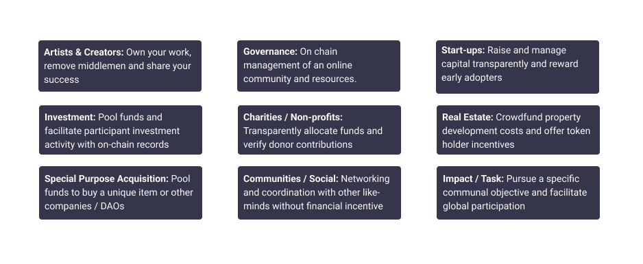

# 🪙 Token Economy

What is a Token? - A means of transacting in the crypto ecosystem.

The concept of a **non-physical currency, tokens or coins** can be confusing to many but in recent times with the blockchain, innovative technology for creating and transferring value is becoming a mainstream discussion point.&#x20;

Token is fluid word that you hear a lot in Web3 and crypto discussions and research. In fact, you might hear Bitcoin described as a “crypto token” or something similar, because — technically — all cryptoassets can also be described as tokens. But the word has increasingly taken on two specific meanings that are common enough that there’s a good chance you’ll encounter them.&#x20;

* A “token” often refers to **any cryptocurrency **_**besides**_** Bitcoin and Ethereum** (even though they are also technically tokens). Because Bitcoin and Ethereum are by far the biggest two cryptocurrencies, it’s useful to have a word to describe the universe of other coins. (Another word you might hear with virtually the same meaning is “altcoin”)
* The other increasingly common meaning for “token” has an even more specific connotation, which is to describe **cryptoassets that run on top of another cryptocurrency’s blockchain**. You’ll encounter this usage if you become interested in decentralized finance (or DeFi). While a cryptocurrency like Bitcoin has its own dedicated blockchain, DeFi tokens like Chainlink and Aave run _on top of_, or leverage, an existing blockchain, most commonly Ethereum.


As per Investopedia:

"A crypto token is **a virtual currency token or a denomination of a cryptocurrency**. It represents a tradable asset or utility that resides on its own blockchain and allows the holder to use it for investment or economic purposes."


Tokens in this second category help decentralised applications to do everything from automate interest rates to sell virtual real estate. But they can also be held or traded like any other cryptocurrency. This raises an important point. Not all tokens, coins or currencies are made equal, they are merely digital representations of ownership and value all working to achieve participation and/or exchange.

### Why are tokens important?

Given that you’ll come across the word a lot while researching cryptocurrencies, it’s useful to understand some common connotations. But besides the big-picture definitions in the section above, there are also some categories of cryptoassets that actually have “token” in their name. Here are a few examples of those:

* **DeFi tokens** A new world of cryptocurrency-based protocols that aim to reproduce traditional financial-system functions (lending and saving, insurance, trading) has emerged in recent years. These protocols issue tokens that perform a wide variety of functions but can also be traded or held like any other cryptocurrency.
* **Governance tokens** These are specialized DeFi tokens that give holders a say in the future of a protocol or app, which (being decentralized) don’t have boards of directors or any other central authority. The popular savings protocol Compound, for example, issues all users a token called COMP. This token gives holders a vote in how Compound is upgraded. The more COMP tokens you have, the more votes you get.
* **Non-Fungible Tokens (NFTs)** NFTs represent ownership rights to a unique digital or real-world asset. They can be used to make it more difficult for digital creations to be copied and shared (an issue anyone who has ever visited a Torrent site full of the latest movies and video games understands). They’ve also been used to issue a limited number of digital artworks or sell unique virtual assets like rare items in a video game.&#x20;
* **Security tokens** Security tokens are a new class of assets that aim to be the crypto equivalent of traditional securities like stocks and bonds. Their main use case is to sell shares in a company (very much like the shares or fractional shares sold via conventional markets) or other enterprises (for instance, real estate) without the need for a broker. Major companies and startups have been reported to be investigating security tokens as a potential alternative to other methods of fundraising.

What is Web3? - An evolution of the internet

Centralisation has helped onboard billions of people to the World Wide Web and created the stable, robust infrastructure on which it lives. At the same time, a handful of centralised entities have a stronghold on large swathes of the World Wide Web, unilaterally deciding what should and should not be allowed.

Web3 is the answer to this dilemma. Instead of a Web monopolised by large technology companies, Web3 embraces decentralisation and is being built, operated, and owned by its users. Web3 puts power in the hands of individuals rather than corporations. Before we talk about Web3, let's explore how we got here.

### The early internet 

Most people think of the Web as a continuous pillar of modern life—it was invented and has just existed since. However, the Web most of us know today is quite different from originally imagined. To understand this better, it's helpful to break the Web's short history into loose periods—Web 1.0 and Web 2.0.

#### Web 1.0: Read-Only (1990-2004) 

In 1989, at CERN, Geneva, Tim Berners-Lee was busy developing the protocols that would become the World Wide Web. His idea? To create open, decentralised protocols that allowed information-sharing from anywhere on Earth.

The first inception of Berners-Lee's creation, now known as 'Web 1.0', occurred roughly between 1990 to 2004. Web 1.0 was mainly static websites owned by companies, and there was close to zero interaction between users - individuals seldom produced content - leading to it being known as the read-only web.

#### Web 2.0: Read-Write (2004-now) 

The Web 2.0 period began in 2004 with the emergence of social media platforms. Instead of a read-only, the web evolved to be read-write. Instead of companies providing content to users, they also began to provide platforms to share user-generated content and engage in user-to-user interactions. As more people came online, a handful of top companies began to control a disproportionate amount of the traffic and value generated on the web. Web 2.0 also birthed the advertising-driven revenue model. While users could create content, they didn't own it or benefit from its monetisation.

### Web 3.0: Read-Write-Own 

The premise of 'Web 3.0' was coined by [Ethereum](https://ethereum.org/en/what-is-ethereum/) co-founder Gavin Wood (now [Polkadot](https://polkadot.network/) founder) shortly after Ethereum launched in 2014. Gavin put into words a solution for a problem that many early crypto adopters felt: the Web required too much trust. That is, most of the Web that people know and use today relies on trusting a handful of private companies to act in the public's best interests.

#### Introducing Web3 

**Web3 has become a catch-all term for the vision of a new, better internet**. At its core, Web3 uses blockchains, cryptocurrencies, and NFTs to give power back to the users in the form of ownership. [A 2020 post on Twitter](https://twitter.com/himgajria/status/1266415636789334016) said it best: **Web1 was read-only, Web2 is read-write, Web3 will be read-write-own.**

**Core ideas of Web3**

Although it's challenging to provide a rigid definition of what Web3 is, a few core principles guide its creation.

* **Web3 is sufficiently decentralised:** instead of large swathes of the internet controlled and owned by centralised entities, ownership gets distributed amongst its builders and users.
* **Web3 is permissionless:** everyone has equal access to participate in Web3, and no one gets excluded.
* **Web3 has native payments:** it uses cryptocurrency for spending and sending money online instead of relying on the outdated infrastructure of banks and payment processors.
* **Web3 is trustless:** it operates using incentives and economic mechanisms instead of relying on trusted third-parties.

#### Why is Web3 important? 

Although Web3's killer features aren't isolated and don't fit into neat categories, for simplicity we've tried to separate them to make them easier to understand.

**Ownership**

Web3 gives you ownership of your digital assets in an unprecedented way. For example, say you're playing a web2 game. If you purchase an in-game item, it is tied directly to your account. If the game creators delete your account, you will lose these items. Or, if you stop playing the game, you lose the value you invested into your in-game items.

Web3 allows for direct ownership through [non-fungible tokens (NFTs)](https://ethereum.org/en/nft/). No one, not even the game's creators, has the power to take away your ownership. And, if you stop playing, you can sell or trade your in-game items on open markets and recoup their value.

• [More on NFTs](https://ethereum.org/en/nft/)

**Censorship resistance**

The power dynamic between platforms and content creators is massively imbalanced.

OnlyFans is a user-generated adult content site with over 1-million content creators, many of which use the platform as their primary source of income. In August 2021, OnlyFans announced plans to ban sexually explicit content. The announcement sparked outrage amongst creators on the platform, who felt they were getting robbed of an income on a platform they helped create. After the backlash, the decision got quickly reversed. Despite the creators winning this battle, it highlights a problem for Web 2.0 creators: you lose the reputation and following you accrued if you leave a platform.

On Web3, your data lives on the blockchain. When you decide to leave a platform, you can take your reputation with you, plugging it into another interface that more clearly aligns with your values.

Web 2.0 requires content creators to trust platforms not to change the rules, but censorship resistance is a native feature of a Web3 platform.

**Decentralised autonomous organisations (DAOs)**

As well as owning your data in Web3, you can own the platform as a collective, using tokens that act like shares in a company. DAOs let you coordinate decentralised ownership of a platform and make decisions about its future.

DAOs are defined technically as agreed-upon smart contracts that automate decentralised decision-making over a pool of resources (tokens). Users with tokens vote on how resources get spent, and the code automatically performs the voting outcome.

However, people define many Web3 communities as DAOs. These communities all have different levels of decentralisation and automation by code. Currently, we are exploring what DAOs are and how they might evolve in the future.

• [More on DAOs](https://ethereum.org/en/dao/)

#### Identity 

Traditionally, you would create an account for every platform you use. For example, you might have a Twitter account, a YouTube account, and a Reddit account. Want to change your display name or profile picture? You have to do it across every account. You can use social sign-ins in some cases, but this presents a familiar problem—censorship. In a single click, these platforms can lock you out of your entire online life. Even worse, many platforms require you to trust them with personally identifiable information to create an account.

[Sign-in with Unit Network](https://www.unit.network/home)

#### Native payments 

Web2's payment infrastructure relies on banks and payment processors, excluding people without bank accounts or those who happen to live within the borders of the wrong country. Web3 uses tokens like UNIT to send money directly in the browser and requires no trusted third party.

[More on the UNIT token ->](broken-reference)

### Improving Web3 

Despite the numerous benefits of Web3 in its current form, there are still many limitations that the Unit Network DAO have worked hard to fix.

#### Improved Accessibility 

Important Web3 features, like registration with Unit Network, are already available for anyone to use at zero cost. While the relative cost of transactions has also been greatly reduced compared to protocols like ETH. Web3 is ow fast becoming accessible to less-wealthy, developing nations due to increased transaction speeds and much lower fees. On Unit Network, these challenges are were solved through use of our own blockchain technology and launching on the Polkadot relay-chain.. The technology is ready!

#### Simple User experience 

With Unit Network we have worked hard to incorporate the best of Web2 UI / UX with the security and transparency of blockchain. The technical barrier to entry to using Web3 has been mostly removed allowing users to focus more on community building / developing their project.&#x20;

#### Education & Learning Resources 

Web3 introduces new paradigms that require learning different mental models than the ones used in Web2.0. A similar education drive happened as Web1.0 was gaining popularity in the late 1990s; proponents of the world wide web used a slew of educational techniques to educate the public from simple metaphors (the information highway, browsers, surfing the web) to [television broadcasts](https://www.youtube.com/watch?v=SzQLI7BxfYI). Web3 isn't difficult, but it is different. Educational initiatives informing Web2 users of these Web3 paradigms are vital for its success.

Unit Network contributes to Web3 education through our free [Unit Masters](https://www.unitmasters.org/) program, aiming to distill important Unit Network, tokenisation and crypto content to as many people as possible.

### A decentralised future 

Web3 is a young and evolving ecosystem. Gavin Wood coined the term in 2014, but many of these ideas have only recently become a reality. In the last year alone, there has been a considerable surge in the interest in cryptocurrency, improvements to layer 2 scaling solutions, massive experiments with new forms of governance, and revolutions in digital identity.

We are only at the beginning of creating a better Web with Web3, but as we continue to improve the infrastructure that will support it, the future of the Web looks bright.

### How can I get involved 

* [Register with Unit Network](https://www.unit.network/in/unitteam)
* Find a community
* Explore Web3 applications
* Join a DAO
* Build on Web3

What is a DAO? - Web3 and Decentralised Autonomous Organisations (DAOs)

Currently, society lacks a simple and effective way to distribute value that benefits both owners and users. Following on from the innovation of blockchain and crypto-currenices new methods for organising and executing shared visions or investments into the world of crypto emerged as a variety of **DAOs, Decentralised Autonomous Organisations.**

DAOs are defined technically as agreed-upon smart contracts that automate decentralized decision-making over a pool of resources (tokens). Users with tokens vote on how resources get spent, and the code automatically performs the voting outcome.

Using a decentralised DAO framework powered by tokens can improve many of the legacy systems currently in place. **Users** can build borderless businesses and communities using tokens like shares in a company and coordinate decentralised ownership and make decisions about its future. It is a system of digital cooperation, where ownership is shared for an economic, political or social purpose. Incentives to cooperate are built into a DAO by nature.

However, people define many Web3 communities as DAOs. These communities all have different levels of decentralization and automation by code. Currently, we are exploring what DAOs are and how they might evolve in the future,

<figure><figcaption>
Various industries Web3 stands to disrupt and improve 
</figcaption></figure>

