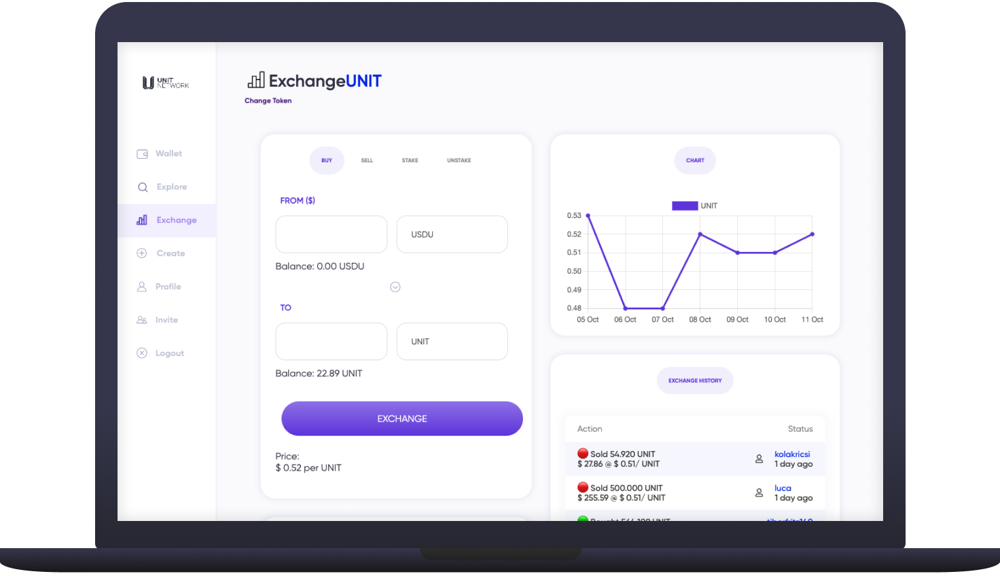
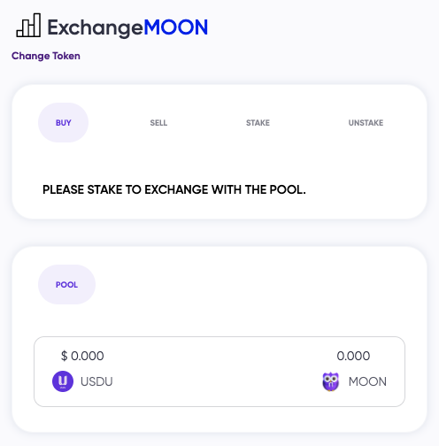
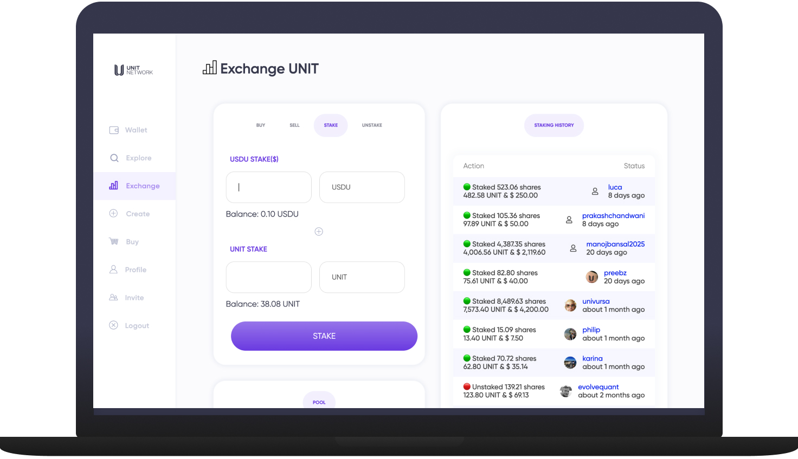

# 🔀 Exchange

<figure><figcaption></figcaption></figure>

**Similar** \
Uniswap\
Pancakeswap\
Coinbase\
Binance

## Overview

Every token created on Unit Network is able to open its own exchange pool to allow buying and selling of any token native to Unit Network. This helps to build an economy around a token by allowing a community to set a market price based on whether they believe a token is overvalued and worth selling, or undervalued and worth buying.&#x20;

Every token created on Unit Network has its own decentralised [Exchange](https://www.unit.network/token/UNIT/exchange\_buy) known as DEX. It is up to the creator to decide whether they open their exchange or not which is covered in more detail below. The exchange protocol used is called an AMM (Automated Market Maker) and is akin to project like  [Uniswap](https://uniswap.org/), [SushiSwap](https://www.sushi.com/) and [PancakeSwap](https://pancakeswap.finance/).


Our exchange protocol is called an AMM (Automated Market Maker) and is akin to other decentralised exchanges (DEXs) like Uniswap, Bancor, SushiSwap, PankcakeSwap etc. An important feature of AMM's is that it allows projects / tokens that may initially have low liquidity to set a token price and create a market that facilitates buying and selling, which is a great alternative to centralised order-book exchanges which typically have prohibitively expensive listing fees.


An important feature of DEXs is that it allows projects / tokens with low liquidity to create a market to facilitate buying, selling and staking. This is an elegant and powerful alternative to centralised order-book exchanges like Binance, which are difficult (if not completely out of reach) for small token projects to list on.

## Exchange Fees

Every [Exchange](https://www.unit.network/token/UNIT/exchange\_buy) on Unit Network has a USDU pairing and charges a 2% fee on each trade, split equally four ways:**‍**

* 0.5% to the UNIT Treasury&#x20;
* 0.5% to the user who invited the exchanger&#x20;
* 0.5% to the liquidity pool&#x20;
* 0.5% to the Treasury of the token being exchanged

## How to exchange tokens

1. Click on any token to view the [<mark style="color:purple;">token dashboard</mark>](https://www.unit.network/token/UNIT) and select [<mark style="color:purple;">Exchange</mark>](https://www.unit.network/token/UNIT/exchange\_buy) from the top sub-menu. On the the Exchange page you will four modules: <mark style="color:purple;">Exchange, Chart, Exchange History</mark> and <mark style="color:purple;">Pool.</mark>

<figure><figcaption></figcaption></figure>

**2.** The the first module shows the <mark style="color:purple;">Buy</mark> tab by default. This is where you will be able to <mark style="color:purple;">Buy, Sell, Stake</mark> and <mark style="color:purple;">Unstake</mark> as the buttons suggest. To buy any tokens you will first need USDU, our reserve stable token. More information on how to get USDU [<mark style="color:purple;">can be found here</mark>](../../overview/ecosystem-daos/unit-stable.md)<mark style="color:purple;">.</mark>

<figure><figcaption></figcaption></figure>

**3.** Enter the amount of USDU you'd like to spend. The conversion from one token to another will be based on the current price of that token which can be seen at the bottom of the <mark style="color:purple;">Exchange</mark> panel (Price: $0.53 per UNIT) and click the <mark style="color:purple;">Exchange</mark> button.

<figure><figcaption></figcaption></figure>

**4.**  An approval screen will pop up for you to either confirm to cancel the exchange. If everything looks correct you can click <mark style="color:purple;">Confirm</mark>

<figure><figcaption></figcaption></figure>

**5.** A confirmation page showing will show that your exchange was successful

<figure><figcaption></figcaption></figure>

## How to open an exchange

Once a token has been created via the 'Create' tab, only the token creator can chose to open the exchange by navigating to the 'Exchange' tab setting an initial price.&#x20;

1. Once you've created a token via the [Create](https://www.unit.network/create) tab, go to the [Explore](https://www.unit.network/explore) page, search for your token and click on it to access the [token dashboard](https://www.unit.network/token/MOON). Click on the [Bank](https://www.unit.network/token/MOON/bank) tab

<figure><figcaption></figcaption></figure>

**2.** Select the <mark style="color:purple;">Transfer</mark> button on the top right of the Bank module and select <mark style="color:purple;">To User</mark>. Complete the data fields as is required. Below, 100,000 MOON (10% of the entire supply) is being transferred to the User wallet of [@moon](https://www.unit.network/user/moon) (who is the $MOON token creator) so that is can be used to open the staking pool.&#x20;

Click <mark style="color:purple;">User Transfer</mark> to complete the transfer of token out of the bank.

<figure><figcaption></figcaption></figure>

**3.** After the tokens have been transferred to your <mark style="color:purple;">user wallet</mark> you can return the exchange module. As the prompt states you will need to [Stake](broken-reference) tokens in each pool. The first stake will set the price and open the exchange.&#x20;

Click on the <mark style="color:purple;">Stake</mark> tab

<figure><figcaption></figcaption></figure>

**4.** The Stake tab is where you can now make the initial stake and set the price of your token based on the ratio of the token and USDU. For clarity lets look at some examples:

* 10 USDU / 1000 MOON = $0.01 per token
* 10 USDU / 100 MOON = $0.10 per token
* 10 USDU / 10 MOON = $1.00 token

For this example we'll set the initial price at $0.10 by adding 10 USDU and 100 MOON (10 divided by 100 = 0.10)


**Choosing the initial Price**: You are able to set any price for the token but we'd recommend starting with something realistic based on the value proposition of your token and how much value you have locked into the Treasury. A smart release mechanism can yield much higher perspectives and provide the right incentives to reward token growers.&#x20;



Staking _more_ tokens to your exchange pools (increasing the depth) will increase the price stability but it may also increase your [impermanent loss](https://blockworks.co/the-investors-guide-to-navigating-impermanent-loss/) if the price increases dramatically.  &#x20;


<figure><figcaption>
 
</figcaption></figure>

**5.** An approval screen will pop up for you to either confirm to cancel the exchange. If everything looks correct you can click <mark style="color:purple;">Confirm Stake</mark>

<figure><figcaption></figcaption></figure>

**6.** A confirmation page showing will show that your initial stake was successful

<figure><figcaption></figcaption></figure>

7\. Navigate back to your token dashboard and select exchange. You will see the exchange is now live with the chart registering price action and pools showing liquidity.

<figure><figcaption></figcaption></figure>

<figure><figcaption></figcaption></figure>

Exchange Pool Staking - Brief detail on how liquidity pool staking works.

**Similar** \
Uniswap\
Pancakeswap\
Coinbase\
Binance

## Overview

Liquidity Pool Staking is the process by which you add your tokens to the exchange pool for other users to trade with and for doing this you earn a fee from each trade based on how many shares of the exchange pool you own. In simple words — you “stake” your tokens and earn fees for providing liquidity.


Liquidity pools are smart contracts that power DeFi (decentralised finance) marketplaces across much of the crypto ecosystem. On Unit Network as with other DEX's, these pools contain digital funds that facilitate users to buy and sell tokens.


On Unit Network, liquidity providers (LP Stakers) receive up to 0.5% in USDU of every trade for pools they have staked in.

## How to Stake

Unit Network currently supports LP Staking of all token pairs.&#x20;

1\. Click the [<mark style="color:purple;">Explore</mark>](https://www.unit.network/explore) tab and search for a token you want to stake&#x20;

2\. Click <mark style="color:purple;">Exchange</mark>

3\. Click <mark style="color:purple;">Stake</mark>

4\.  Add the amount you want to stake in USDU and an equivalent amount in the token you selected in 1 to 1 ratio.&#x20;


For example, if you would like to stake 100 UNIT at the $1 price, you will have to  add 439.23 USDU in addition to 100 UNIT to the pool. If you don't have enough USDU in your wallet, you can top up your balance [<mark style="color:purple;">here</mark>](https://www.unit.network/t/USDU/sale), using any of the Blue Chips.&#x20;


5\. Click <mark style="color:purple;">Stake</mark>

6\. Receive shares of the pool, so when exchange fees are made, you receive a % based on your shares of the pool.

_0.5% of staking rewards are redistributed to the liquidity pool, and LPs receive rewards based on the shareholding % in the pool. In order to realise the rewards, LPs will have to unstake the tokens._

## How to Unstake

1\. Click the [<mark style="color:purple;">Explore</mark>](https://www.unit.network/explore) tab and search for a token you want to unstake&#x20;

2\. Click <mark style="color:purple;">Exchange</mark>

3\. Click <mark style="color:purple;">Unstake</mark>

4\. Enter the amount you would like to unstake

5\. Click <mark style="color:purple;">Confirm</mark>

6\. Unstaked tokens will appear in your Wallet with realised reward

## Liquidity Pool Staking FAQ

Why do I have to pair tokens to stake them in liquidity pools?

This is based on the concept of an AMM (Automated Market Maker), which allows tokens to be traded against a pool in which token holders have staked tokens. When people trade against this exchange pool, the exchange rate changes based on what people are buying/selling.

What is liquidity pool staking?

On Unit Network, liquidity pool staking allows the exchange pool to have tokens which people can trade against. There is a small fee that gets taken and added to the pool when people trade, incentivizing people to stake tokens in order to provide liquidity.

Can I trade any token for any other token on Unit Network directly?

Each token created on Unit Network has its own liquidity pool, paired with USDU, the US dollar stablecoin of the Unit Network, as TOKEN-USDU. A person trading TOKEN for USDU or USDU for TOKEN trades with the pool, rather than directly one-on-one with another individual buyer or seller. Once the one token is added and the other is removed from the pool, minus the fee for trading, the ratio in the pool adjusts back to 50-50 value, and the price of one in terms of the other is changed. Similar to the functionality on https://uniswap.org/.

##
