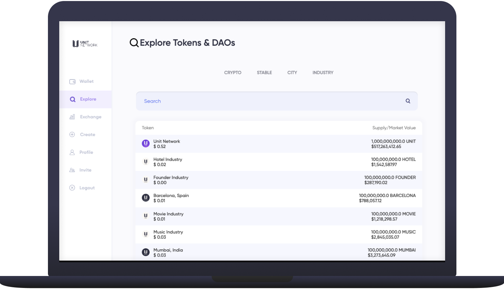

# 🗺 Explore

<figure><figcaption></figcaption></figure>

## Overview

The [Explore](https://www.unit.network/explore) page is where you can easily search for all tokens available on Unit Network. It will become an important dashboard in the future as users are able to sell products and services purchasable with tokens, all of which will be found here too.&#x20;

## Crypto

The [Crypto](https://www.unit.network/explore?tab=crypto) sub-menu displays all the [Blue Chip](broken-reference) assets we support on Unit Network like Bitcoin. Selecting any one of them will take you to the [token dashboard](https://www.unit.network/token/BTCU) where you can find the [Info](https://www.unit.network/token/BTCU), [Community](https://www.unit.network/token/BTCU/community) and [Exchange](https://www.unit.network/token/BTCU/exchange\_buy).

<figure><figcaption></figcaption></figure>

## Stable

The [Stable](https://www.unit.network/explore?tab=stable) sub-menu displays all the [Stable Tokens](../../../overview/ecosystem-daos/unit-stable.md) we support on Unit Network like USDU. Selecting any one of them will take you to the [token dashboard](https://www.unit.network/token/USDU) where you can find the [Info](https://www.unit.network/token/USDU), [Community](https://www.unit.network/token/USDU/community) and Exchange (Excluding USDU).

<figure><figcaption></figcaption></figure>

## City

The [City](https://www.unit.network/explore?tab=city) sub-menu displays all the [City Tokens](broken-reference) created by Unit Network like NEWYORK. Selecting any one of them will take you to the [token dashboard](https://www.unit.network/token/NEWYORK) where you can find the [Info](https://www.unit.network/token/NEWYORK), [Community](https://www.unit.network/token/NEWYORK/community) and [Exchange](https://www.unit.network/token/NEWYORK/exchange\_buy)

<figure><figcaption></figcaption></figure>

## Industry

The [Industry](https://www.unit.network/explore?tab=industry) sub-menu displays all the [Industry Tokens](broken-reference) created by Unit Network like MUSIC. Selecting any one of them will take you to the [token dashboard](https://www.unit.network/token/MUSIC) where you can find the [Info](https://www.unit.network/token/MUSIC), [Community](https://www.unit.network/token/MUSIC/community) and [Exchange](https://www.unit.network/token/MUSIC/exchange\_buy).

<figure><figcaption></figcaption></figure>

