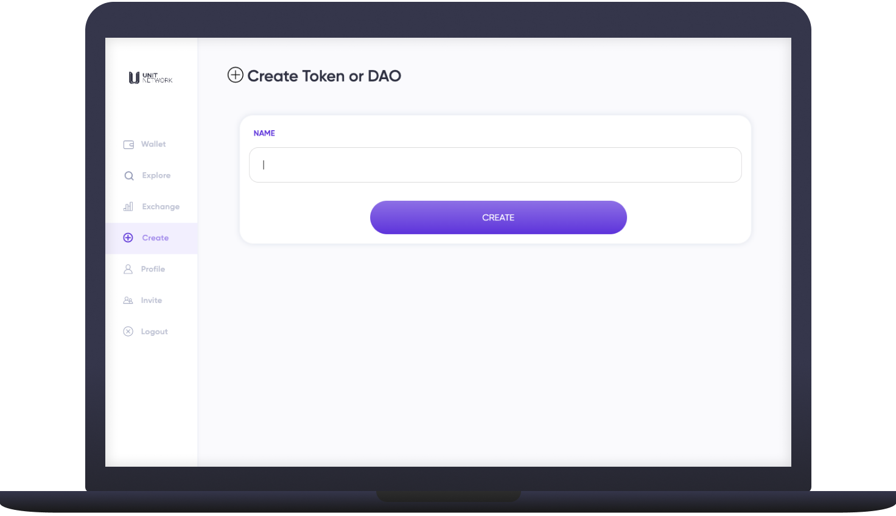

# ➕ Create

<figure><figcaption></figcaption></figure>

## Overview

**Any user on Unit Network is able to quickly create their own crypto token/s. Creating a token is completely free and there is no limit to the amount of tokens you can create.**&#x20;

Creating a token used to be a fairly difficult process requiring blockchain development knowledge or support, but in recent years has become more simple with protocols like Ethereum, Solana and Cosmos allowing users to launch their own smart contracts, tokens or NFTs on-top of their blockchains.

While tools to create tokens have been getting better by the day, the few token creation platforms have been taking slightly different approaches focusing either on DAOs, creators, communities, IPOs and/or decentralised banking.&#x20;

Unit Network brings all of these concepts together, on its own blockchain that is purpose built to manage and scale the token economy, communities and businesses globally.&#x20;

## Use

Tokens are an amazing technology as they can serve a myriad of different purposes. At the core, tokens allows creators (businesses, projects, entrepreneurs, celebrities, artists, musicians etc.) to build extremely valuable relationships with their communities, fans or customers from the beginning.

Tokens provide easier fundraising/financing from more parties which reduces the risk of failure due to more parties being invested in the success. Additionally, the fundraising and investing process is more transparent.

It is the complete democratisation of business creation, commerce and investment without borders.

* **Artists & Creators:** Own your work, remove middlemen and share your success with fans
* **Investment:** Pool funds and facilitate participant investment activity with on-chain records
* **Governance:** Manage an online community with shared resources
* **Charities / Non-profits:** Transparently allocate funds and verify donor contributions
* **Start-ups:** Raise and manage capital transparently and reward early adopters
* **Real Estate:** Crowdfund property development costs and offer token holder incentives
* **Special Purpose Acquisition:** Pool funds to buy a unique item or other companies / DAOs
* **Social:** Networking and coordination with other like-minds without financial incentive
* **Impact / Task:** Pursue a specific communal objective and facilitate global participation

## Conditions

Once a token has been created it is deployed on the UnitChain and is subject to a few conditions.&#x20;

* The total supply CANNOT be adjusted if you do not hold all the tokens. This protects token holders from being 'diluted' or having the value of their tokens decrease due to more tokens being added (inflation).
* All token symbols are displayed in capital letters e.g. MUSIC, UNIT, NEWYORK and may sometimes be shown with the dollar sign in front to ensure its understood as token e.g. $MUSIC, $UNIT, $NEWYORK
* Tokens created on Unit Network are not yet able to be withdrawn from the platform but will become possible when we launch the self custodial wallet.

## Specifications&#x20;

**For all tokens created on Unit Network**

Token Standard: UNT (Similar to ERC-20 offered by Ethereum)

Transferrable: Yes

Fungible: Yes

Expiry: No&#x20;

Utility: Defined by user

## How to create a token

### **Preparation**

Creating a token on Unit Network only takes a few seconds and zero blockchain or cryptocurrency knowledge is required. **It is currently the fastest and simplest token creation tool available.** However, even though it's possible to create a token easily the value proposition and mechanics of the token that can take some time to figure out depending on what you're trying to build.

**Example 1:** Creating a token to raise $5,000 from your fans to records a new music video is fairly straight forward.

**Example 2:** Creating a token to raise $500,000 to launch a new tech start-up will require more consideration.&#x20;

Both examples make use of the same token creation technology to facilitate fundraising but would have to meet different community or investor expectations.&#x20;

Anyone can still make a token with just name if they choose to, though for a successful token launch we recommend you consider the following,&#x20;

* **Token Name**
* **Token Symbol**
* **Token Image**
* **Total Token Supply**
* **Token Description**
* **Tokenomics**


**Total Supply:** is a baseline which make the total number of tokens equal to what you estimate the project will be valued at the current stage. The evaluation of the project will increase based on the release mechanism and bank/treasury balances. **Please note: total supply is fixed, it cannot be changed or updated if you do not hold all the tokens.**&#x20;


Depending on the utility of your token it is also advised create up a <mark style="color:purple;">website</mark>, <mark style="color:purple;">whitepaper</mark>, <mark style="color:purple;">pitch deck</mark> or <mark style="color:purple;">simple business proposal</mark> that describes what your token is about and how it functions. _You want to share your unique token and value proposition with people in a simple and concise way so they can make an informed choice as to whether or not they wish to participate in your token economy._

**For example:**

* **Token Name:** Mooncoin
* **Symbol:** MOONCOIN
* **Image:** Owl Avatar
* **Total Token Supply:** 1,000,000
* **Token Description:** Professor Moon is a multi-dimensional owl and aggregation of the Unit Network knowledge base.
* **Tokenomics:** MOONCOIN is airdropped to community members who add value to the Unit Network ecosystem. Top token holders are eligible to limited edition merch drops, internal events and  can choose to sit on the advisory board. The Token represents kudos or social credits within the ecosystem which can be flaunted by valued supporters. MOONCOIN cannot be bought or sold on the exchange, only earned or transferred.&#x20;

### Issue a token&#x20;

**Step 1:**  Click on 'create' on the sidebar navigation

<figure><figcaption></figcaption></figure>

**Step 2:** Add your desired token name (this _can_ be changed later if need be)

<figure><figcaption></figcaption></figure>

**Step 3:**  Personalise your token details in the relevant fields. At a minimum you should add a Description, Image, Token Supply, Symbol (e.g. BTC, ETH, UNIT, SOL) and save your changes.

<figure><figcaption></figcaption></figure>

**Next steps:** That's it! Your token is live on Unit Network. For next steps you'll either want to [transfer tokens](../wallet/wallet.md) to your friends, [open a sale](../../core-apps/sale.md) round to sell your tokens or [open an exchange](broken-reference) for your token. Additionally, you can manage and engage your token community with a myriad of community features like Polls, Stores, Contests

## Token FAQ

What’s the difference between a token and traditional equity?

The key difference between equity (to which traditional dividends are paid) and a token with an aggregation of digital assets (the Treasury) is that equity holders cannot spend their equity stake elsewhere in the economy – i.e. there is no “utility”. Instead, equity owners need to be paid dividends in a currency that other people accept in order to bridge the gap between their investment in this equity and other spending or investing they want to do.

Brilliantly, token holders need no bridge – the gap is closed. They need not reach into the Treasury and take out their "dividends" because they can convert one token to another or spend that token directly within that token's ecosystem. The value is unlocked and flows freely.

Why should I create a token?

Tokens allow for a more effective and fair way of distributing and moving value around the economy to all stakeholders.

Why should anyone tokenise a business / community / IP / etc?

#### Main reasons:

* Ease to get liquidity for the founders/investors
* Allows customers/employees to have aligned incentives&#x20;
* Easier fundraising/financing from more parties&#x20;
* Lower risks of failure due to more parties being invested in the success
* More transparent/less opaque

How can I utilise tokens in the ‘real world’?

Issue tokens for projects/organizations, buy tokens, spend tokens, educate people about the benefits for tokens.

Will tokens primarily be a speculative investment?

The goal is to create as much real value in the form of products and services delivered, from the start, so as not to depend on the speculative value that powers much of the token world.

What are the payback terms for issuing tokens?

Completely up to the creator of the tokens. If it’s unfair or not transparent, people will not buy the token.

How will I declare it tax-wise?

You pay local taxes on your income and/or gains as is normally appropriate for your situation.

How do personal tokens work?

The token creator creates rules and decides how many tokens are for sale, how many team members they want, etc. The token holders are a community revolving around the personal token as that person’s digital center of gravity, together striving for and sharing in the person’s success.

What are the benefits of joining the platform for new small brands/companies?

Many industries have relatively high failure rates for new brands or businesses. Creating a token helps to increase the possibility of success because token owners have a stake in the business.

&#x20;

