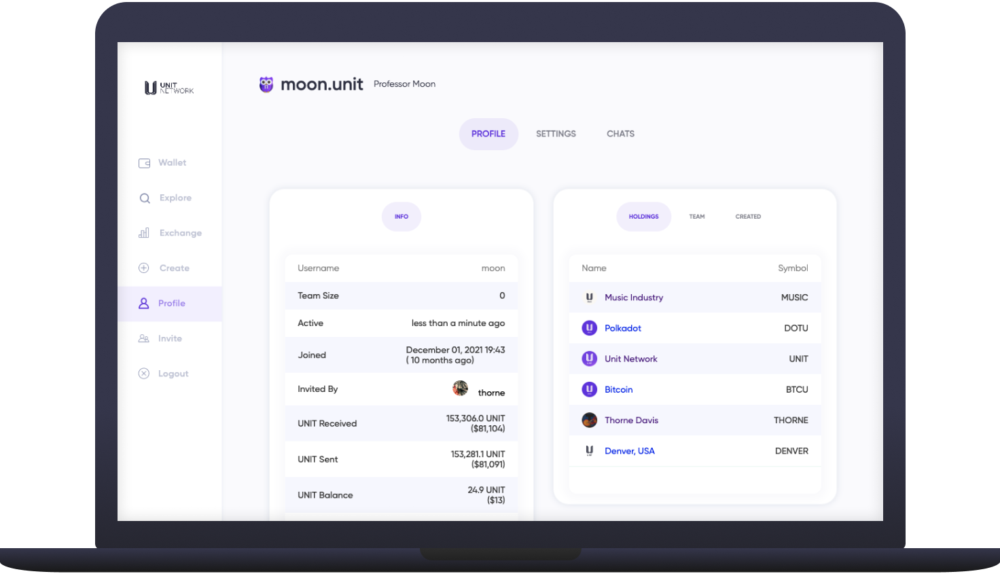

# 👤 Profile

<figure><figcaption>
v
</figcaption></figure>

**The**[ **Profile** ](https://www.unit.network/user/)**page is your account overview, showing general info, token holdings, team tokens and user generated tokens.**


All of the information shown on the [Profile](https://www.unit.network/user/moon) page is public


Info - Information tab that explains all about account and data usage.

<figure><figcaption></figcaption></figure>

**The**[ **Info** ](https://www.unit.network/user/moon)**tab publicly displays your account and usage data.**

Lets take a look at each one:

* **Username:** Current user name. This can be adjusted in [settings](https://www.unit.network/settings) as a random user name is automatically assigned.
* **Time Size:** Users registered with your invite link
* **Joined:** Date account was created
* **Invited By:** User who invited you
* **UNIT Received:** Total UNIT received to your wallet
* **UNIT Sent:** Total UNIT sent from your wallet
* **UNIT Balance:** Total UNIT currently held
* **Socials:** Links to your socials, set in the settings tab
* **Bio:** User biography, set in the settings tab&#x20;

**Holdings - An overview of the holdings account.**

<figure><figcaption></figcaption></figure>

**The**[ **Holdings** ](https://www.unit.network/user/moon)**tab publicly displays the various tokens you hold in your** [**Wallet**](../wallet/)**, but the quantities are private.**

**Team - An overview of a token's team page.**

<figure><figcaption></figcaption></figure>

**The**[ **Team** ](https://www.unit.network/user/moon)**tab publicly displays any tokens of which you are a team member.**&#x20;

Token creators are able to add other users as team members with set token allocations and the option to add a cliff and vest period.&#x20;

This is different to just being a token holder. It allows a token creator to incentivise core team members to participate in the projects development, offering tokens as a reward.&#x20;


Currently any user is able to add any other user to their team **without** permission. We are looking to adjust this so that users who have been added to a team must first approve the request before being added.


**Created - An explanation of the created token page.**

<figure><figcaption></figcaption></figure>

**The**[ **Created** ](https://www.unit.network/user/moon)**tab shows all tokens you have created and how many of those tokens you hold in your personal wallet.**&#x20;


This tab can also be accessed from the [Wallet](broken-reference) page


If you have just created a token and the quantity is showing '0' beneath quantity as seen above, this is because none of the token have been sent out of the [Tokens Bank](../../core-apps/bank-and-treasury.md) to your wallet.

