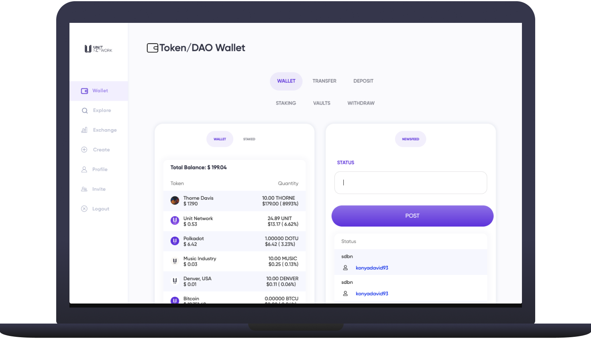
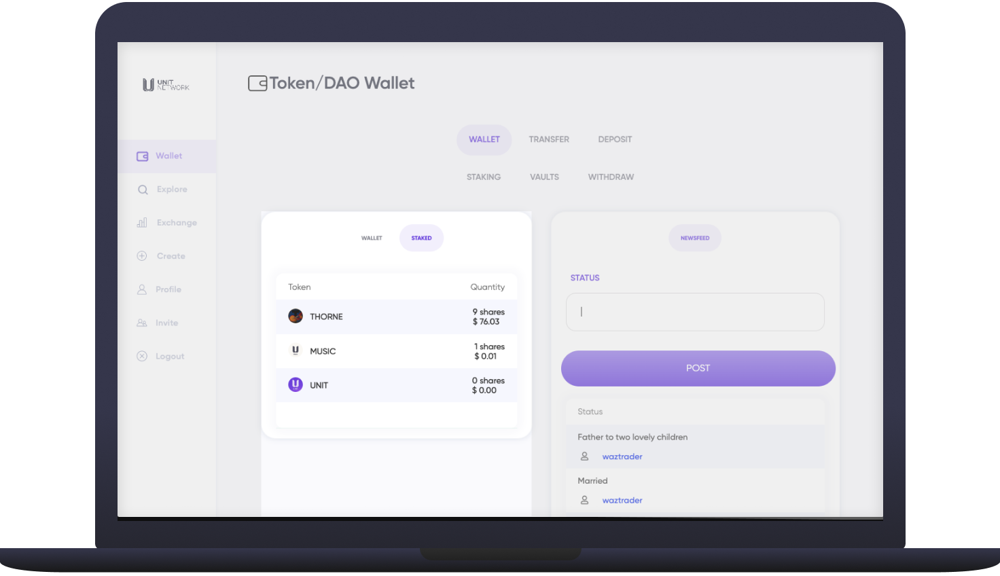

# 🛄 Wallet

<figure><figcaption></figcaption></figure>

## Overview

The Wallet page is the current dashboard showing your portfolio overview with tabs to access [LP Staking](broken-reference) positions and [tokens you've created](broken-reference) as well as a public Newsfeed

## Wallet:&#x20;

The [Wallet](https://www.unit.network/wallet) is a secure and versatile personal multi-coin / multi-token wallet that can hold all of the different cryptocurrencies we support (see [Blue Chips](broken-reference)) and any of the tokens created on Unit Network.&#x20;

The wallet displays:

* Token name, symbol and image
* Price of each token
* Quantity of the tokens held
* Total wallet value


We are currently working on a self custodial wallet with [Substrate Connect](https://substrate.io/developers/substrate-connect) that will allows users to own their private keys and interact with other ecosystems.


<figure><figcaption></figcaption></figure>

Bond Staked - A brief summary of what to expect on the staked tab.

## Overview:

The [Staked](https://www.unit.network/wallet?wallet\_type=staking) tab shows tokens that you currently have staked in any staking pools, see [Liquidity Pool Staking](broken-reference) for more info about how to stake and un-stake your tokens.

##

##
