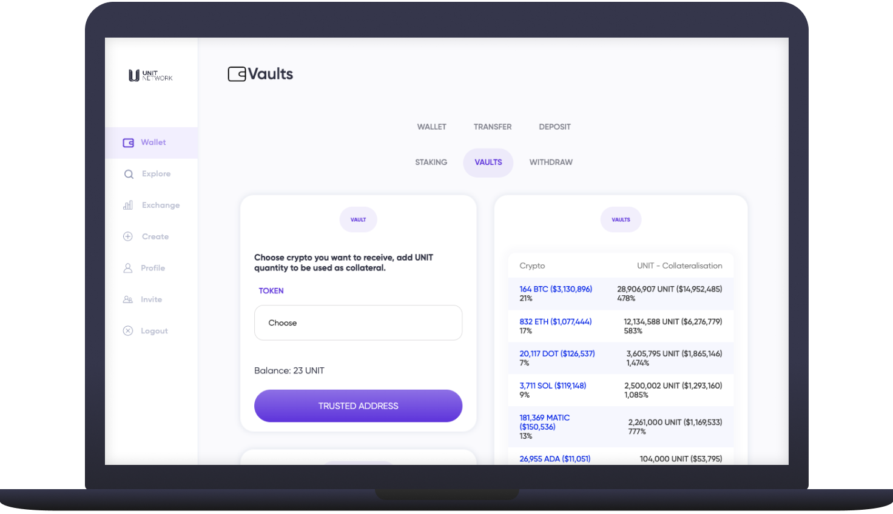

# 🛅 Vaults


Please note that the Vaults are not yet live. We are aiming for launch late Q1 of 2023 and appreciate your patience in the meantime.


<figure><figcaption></figcaption></figure>

## Overview

As Unit Network deals with many cryptocurrencies that are not native like Bitcoin, Ethereum etc. we have built an innovative mechanism to manage these assets, allowing them to be used on our platform without [centralised wrapping](https://www.coindesk.com/learn/what-are-wrapped-tokens/) or [bridges](https://www.coindesk.com/learn/are-blockchain-bridges-safe-why-bridges-are-targets-of-hacks/) which create security vulnerabilities and centralised custodial risks.

All crypto sent to Unit Network is distributed to external user wallets via the Vaults with UNIT serving as the reserve asset. This enables _decentralised_ wrapping / unwrapping, reduces selling pressure and creates a ‘float’ that Vault participants can use to re-invest in other projects while still owning their UNIT

## Use

* **Crypto Loans:** Lock your UNIT in any crypto vaults (BTC Vault, ETH Vault, DOT Vault etc.) as a reserve asset to take out crypto loans with no interest, no expiry date and margin calls and a variable [LTV](https://www.investopedia.com/terms/l/loantovalue.asp) based on risk profile of user.&#x20;
* **Decentralised Wrapping:** Deposits to Unit Network are then sent directly to the external wallet addresses of the Vault owners who have locked their UNIT tokens as a reserve asset. Wrapped tokens are then generated and sent to the user who has made the deposit request.

## Navigating the Vaults

1. To assist explanation we will look specifically at the Bitcoin (BTC) Vault seen below.

**Crypto:** All the crypto vaults available to UNIT token holders. Click a Vault to [explore specific details](https://www.unit.network/wallet/vaults/BTC)

* 164 BTC ($3,122,797) = The _total_ quantity of Bitcoin held on Unit Network and the current USD value
* 32% = Percentage of share of total Vault value&#x20;

**UNIT - Reserve Asset** **Backing**

* 18,939,806 UNIT ($9,796,869) = The total quantity of UNIT staked in the Bitcoin Vault and the current USD value
* 314% = Reserve asset backing of the Bitcoin Vault

<figure><figcaption></figcaption></figure>

## How to borrow crypto with the Vaults

1. Select the [<mark style="color:purple;">Wallet</mark>](https://www.unit.network/wallet) page from the left navigation panel and choose [Vaults](https://www.unit.network/wallet/vaults)

<figure><figcaption></figcaption></figure>

2\. Choose the crypto you would like to receive as a loan for locking up your UNIT from the dropdown menu.

<figure><figcaption></figcaption></figure>

3\. Add a trusted, external wallet address that will receive the loaned crypto, if you have already added a trusted address please ensure that it is correct. **We are not able to recover funds that are sent to wrong address**

<figure><figcaption></figcaption></figure>

4\. Add the quantity of UNIT that you'd like to lock as a reserve asset. Click 'Add UNIT To Vault' and confirm when prompted.

<figure><figcaption></figcaption></figure>

5\. Upon success you will see your vault staking history and a total of UNIT held

<figure><figcaption></figcaption></figure>

## Vault FAQ

What is decentralised token wrapping?

[Blue chip](../../../overview/ecosystem-daos/unit-crypto.md) tokens must be “wrapped” onto Unit Network to be employed in the Token Economy. Wrapping is common in blockchain today, but native tokens are generally held by a custodian subject to centralised custodial risks.&#x20;

On Unit Network the Vaults are used to distribute / decentralise the blue chip token custody by allowing any UNIT holder to lock their UNIT into the Vaults as a reserve asset and become a trusted custodian of the blue chip assets that are being deposited.

How does decentralised token wrapping work on Unit Network?

1. A UNIT token holder creates a “vault” dedicated to wrapping a particular level 1 token – e.g., BTC – and “locks” a chosen amount of UNIT in the vault.
2. A user deposits a level 1 token to Unit Network. That is, a. the depositor is assigned a vault and sends a native token to the assigned vault-creator’s personal wallet off the Unit chain, and b. the vault mints a wrapped token (e.g., BTCU) to the depositor’s personal wallet to be used on the Unit chain.
3. What is decentralized banking?

Deposits are zero-interest loans to vaults, like bank deposits, and vault creators, like banks, can invest borrowed funds to earn a return. UNIT is locked as a vault’s reserves until the vault’s loan balance is fully repaid – i.e. a withdrawal is processed.

Unit Network automatically allocates each new deposit to the vault with (1) the highest reserve ratio (current UNIT/Loan value), and, if tied, (2) the most UNIT.

What’s so revolutionary about decentralised banking?

Today, banking is centralized. For decades, bank depositors ignored bank safety and relied on inflationary government deposit insurance to protect their funds, resulting in extremely low reserve ratios set by fiat and a rickety banking system prone to collapse. In a free market, bank depositors care about banks’ reserves, and banks compete for customer deposits by demonstrating prudent reserve management and safety.

On Unit Network, decentralized vaults wrap deflationary digital stores of value onto Unit Network for use in the token economy, making UNIT the pristine reserve asset of the world’s decentral bank.

How are withdrawals handled?

Withdrawals from the Unit chain pay a 1% fee, split equally between the UNIT treasury (0.5%) and the vault that processes the withdrawal (0.5%). Requests go into a queue, and vaults compete to process withdrawals and earn fees. Any vault can process a withdrawal/unwrapping.

What are some benefits of the Vaults?

Facilitates wrapping of crypto (BTC/ETH/DOT, etc.) onto the Unit Network in a decentralised way (unlike WBTC) Much less sell pressure for UNIT (as people can get a loan against UNIT instead of selling it on the market) More UNIT locked up over time (as it will be held in Unit vaults) Allows anyone to receive staking rewards for wrapped crypto tokens on the Unit Network (BTCU/ ETHU / DOTU etc) More demand and buy pressure for UNIT, as a reserve for the vaults with no risk of being liquidated/margin called. As this way the deposit / withdraws work is to ensure that the high reserve vaults receive the deposits / wrapping, and the low-reserve vaults handle withdraws / unwrapping - balancing it over time.

Is the reserve / loan amount already known?

No specific reserves-to-loan ratio is prescribed, as the Unit Network is ensuring at all times that the underlying funds are distributed in the least risky distribution. Will depend on the price of UNIT, distribution of UNIT across vaults, the price of underlying unwrapped assets, and other market conditions.

How much do vaults have to pay to borrow? What is the vault APR?

APR is the cost to borrow funds. There is no interest or cost to borrow from the vaults, as the vaults are delivering value to the network for being the decentralised custody of the underlying digital reserve assets.

Will there be any arbitrage opportunities with the vaults?

Not specifically, though there are lots of arbitrage opportunities with the exchange pools.

What are some scenarios for how deposits are distributed to vaults?

#### Scenario 1:

Vault A 300k UNIT 0 BTC

Vault B 200k UNIT 0 BTC

Vault C 100k UNIT 0 BTC

10 BTC deposit will go to vault A as least risky.

#### Scenario 2:

Vault A 300k UNIT 20 BTC 15k UNIT/BTC ratio

Vault B 200k UNIT 0 BTC

Vault C 100k UNIT 0 BTC

10 BTC deposit will go to vault B as least risky.

#### Scenario 3:

Vault A 300k UNIT 20 BTC 15k UNIT/BTC ratio

Vault B 200k UNIT 10 BTC 20k UNIT/BTC ratio

Vault C 100k UNIT 0 BTC

1 BTC deposit will go to vault C as least risky.

#### Scenario 4:

Vault A 300k UNIT 20 BTC 15k UNIT/BTC ratio

Vault B 200k UNIT 10 BTC 20k UNIT/BTC ratio

Vault C 100k UNIT 1 BTC 100k UNIT/BTC ratio

1 BTC deposit will go to vault C as least risky.

#### Scenario 5:

Vault A 300k UNIT 20 BTC 15k UNIT/BTC ratio

Vault B 200k UNIT 10 BTC 20k UNIT/BTC ratio

Vault C 100k UNIT 2 BTC 50k UNIT/BTC ratio

1 BTC deposit will go to vault C as least risky.

What’s an example of how a withdrawal works?

Say you wanted to withdraw 100 BTCU to receive 99 BTC due to 1% withdrawal fee (1BTC).

99.5 BTCU goes to the person who is sending me 99 BTC, and 0.5 BTCU goes to UNIT Treasury.

100 BTCU being unwrapped/withdrawn 0.5 BTCU to UNIT Treasury 0.5 BTCU to user processing withdraw 99 BTCU to user processing withdraw

You withdraw 100 BTCU, receive 99 BTC User sends me 99 BTC, receives 99.5 BTCU UNIT Treasury gets 0.5 BTCU

1. Why would someone lend money to someone with UNIT as reserve? ‍ They want and need to wrap their tokens in order to partake in the token economy, and the vaults allow them to do it in a decentralised way.
2. What are the risks involved in creating a vault? ‍Minimal risk due to not having to worry about margin calls (unlike borrowing on Celsius/Nexo etc). As even if the value of your UNIT drops, you still only have to pay back the original loan and your UNIT will be immediately returned to your wallet.

How does one measure the “riskiness” of a Vault if all Vault reserves are in UNIT?

Based on (in order of priority) :

1. ratio of UNIT in vault to loan amount taken by vault
2. amount of UNIT in vault

So even if: Vault A has 100,000 UNIT - with 0.5 BTC loan Vault B has 20,000 UNIT - with no BTC loan, Vault B is less risky, as it has no loan against it.

1. When I lock up UNIT as reserves and it increases in price, will I be able to borrow more BTC? ‍ Yes. Although the borrowing happens automatically, including the amounts that you borrow. You are just adding UNIT to your BTC vault, and the UNIT network will decide how much of a loan you get as reward for your participation in the decentralized wrapping process.
2. What happens if it decreases in price again - will I then have an under-reserved loan? ‍ Yes. Although this is highly unlikely to be the case as the loan given will be a fraction of the UNIT reserves locked up, noting again that only the least risky vaults on the network are given loans in the first place.

However, in the event that the UNIT reserves do become worth less than the loan, instead of it being dumped onto the market/liquidated like a missed margin call for a leveraged trader (which has the effect of further depressing the price/causing a downward spiral), it effectively stays locked up/removed from the circulating supply until it makes sense for the borrower to pay back the loan.

How much can I under-reserve until the network will not give me loans anymore? ‍ 

&#x20;If you are under-reserved, or anywhere close to it, the Unit Network will not give you a loan, as you become a more risky vault relative to the others on the network.

