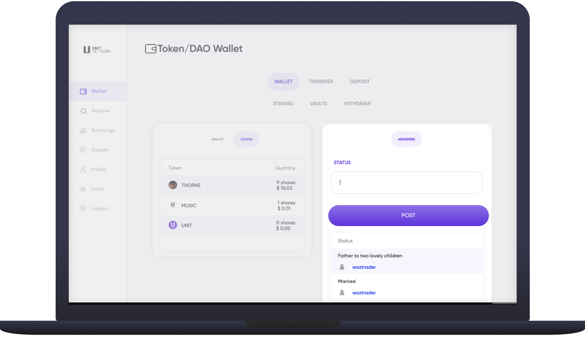

# 🗞 News

<figure><figcaption></figcaption></figure>

## Overview:

The [Newsfeed](https://www.unit.network/wallet) module is a public notification board. Text and links can be shared for everyone in the community to see. At this stage the Newsfeed is very basic but will be improved overtime.&#x20;

##
