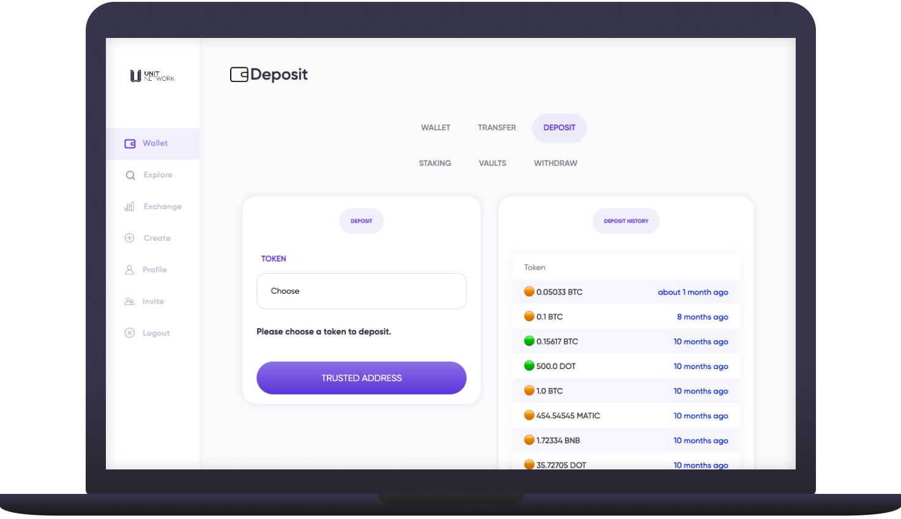

# ↙ Deposit

<figure><figcaption></figcaption></figure>

## Overview

Depositing your crypto to Unit Network can be done via the [Deposit](https://www.unit.network/wallet/deposit) tab of your user wallet.

If you do not already have crypto you can purchase Bitcoin with your debit / credit card through [Moonpay](https://www.moonpay.com/) or any other exchange most suited to where you are located like [Binance](https://www.binance.com/en), [Coinbase](https://www.coinbase.com/) or [Kraken](https://www.kraken.com/en-us). In the event you purchase from an exchange please read the warning below as you will first need to send to a private wallet before transferring to Unit Network.&#x20;

For users wishing to purchase over $250K USD please contact our sales team as we can assist with a smooth onramp through [Bitcoin Suisse](https://www.bitcoinsuisse.com/).


**Important!** Do not send your crypto to Unit Network directly from a centralised exchange like [Binance](https://www.binance.com/en), [Coinbase](https://www.coinbase.com/) etc. The crypto must arrive from a self-custodial wallet like [Ledger](https://www.ledger.com/), [Trezor](https://trezor.io/), [MetaMask](https://metamask.io/), [Exodus](https://www.exodus.com/) etc. so the transaction can be verified.&#x20;

This is quick and simple to do. We recommend [Exodus](https://www.exodus.com/) Wallet as it can hold nearly all cryptocurrencies.



For information on which networks to use when transferring your crypto to Unit Network and their respective block explorers please see the [Blue Chips](broken-reference) page. **Currently we only support native networks for deposits.** For example, if you are trying to deposit BTC you must do so via Native SegWit, not BEP20 or any others.


## How to deposit crypto

1\. Select the [<mark style="color:purple;">Wallet</mark>](https://www.unit.network/wallet) page from the left navigation panel and chose [<mark style="color:purple;">Deposit</mark>](https://www.unit.network/wallet/deposit)

<figure><figcaption></figcaption></figure>

2\. Select from the <mark style="color:purple;">TOKEN</mark> dropdown which token (BTC, ETH, DOT, etc.) you want to deposit

<figure><figcaption></figcaption></figure>

3\. If you have not selected a trusted deposit address you will see a prompt asking you to add your [trusted address](https://www.unit.network/wallet/addresses?crypto\_symbol=ALGO) which you are using to make to deposit. Copy and paste the personal wallet address from which you will send your chosen token. **Please make sure this is your personal receiving/sending address, and not an exchange address. If you don't have one try** [**Exodus**](https://www.exodus.com/)**.**

<figure><figcaption></figcaption></figure>

4\. When your trusted address has been added you'll see a button to navigate back to the Deposit page

<figure><figcaption></figcaption></figure>

5\. Type in the quantity or dollar-equivalent amount of your chosen token you want to deposit. (please note there is a $100 minimum) Your deposit address should already be populated. Click <mark style="color:purple;">Deposit</mark> &#x20;

<figure><figcaption></figcaption></figure>

6\. On the next page, copy the address under “<mark style="color:purple;">TO \[token] ADDRESS</mark>” (second field) into the wallet from which you are sending the funds (first field).  You can use the QR code as an alternative to copying the "<mark style="color:purple;">TO \[token] ADDRESS</mark>".

<figure><figcaption></figcaption></figure>

7\. Go to your self custodial wallet (Exodus) and select the asset you wish to deposit to Unit Network, select **Send** and then add the amount shown in the “<mark style="color:purple;">\[Token] AMOUNT</mark>” field ($100 or 7.84 ATOM)&#x20;


For information on which networks to use when transferring you'r crypto to Unit Network and their respective block explorers please see the [Blue Chips](broken-reference) page&#x20;


<figure><figcaption></figcaption></figure>

8\. After sending, copy the Transaction ID/Hash from blockchain explorer or the Activity tab of the token you just sent and paste into the “<mark style="color:purple;">TRANSACTION ID/HASH</mark>” field on the Unit Network deposit screen. Click <mark style="color:purple;">UPDATE</mark>.

9\. Under “<mark style="color:purple;">STATUS</mark>”, the deposit status will be “<mark style="color:purple;">pending</mark>” until it turns to “<mark style="color:purple;">completed</mark>”. You can hit the refresh button to see updates. Blockchain transactions can take some time.

10\. Once the deposit is complete, click on the <mark style="color:purple;">Wallet</mark> page to find your token/s.

##
