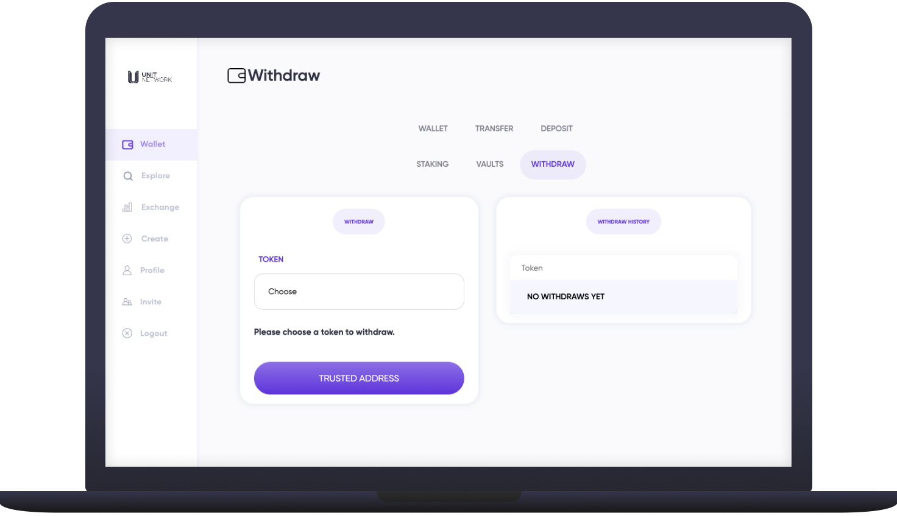

# ↗ Withdraw


Please note that automated withdrawals are not yet live. Select user withdrawals are being processed manually for time while we are aiming to completely open Withdrawals late Q4 of 2022 and appreciate your patience in the meantime.


<figure><figcaption></figcaption></figure>

## Overview

A [withdrawal](https://www.unit.network/wallet/withdraw) from Unit Network is **a transaction of transferring crypto from the Unit Network environment to an external address** (usually a wallet like Exodus or an exchange like Binance). As with all blockchain transactions - and contrary to sending tokens or crypto to another Unit Network  user - withdrawals are charged a 1% fee.


**Currently users are only able to** [**withdraw**](https://www.unit.network/wallet/withdraw) **the** [**Blue Chip** ](broken-reference)**assets we support.** The UNIT token and all user generated tokens are _not_ interoperable with other crypto ecosystems until we roll out the self custodial wallets


It is also important to note that withdrawing requires the coins or tokens to be unwrapped which is facilitated by the [Vaults](exchange.md). Withdrawal requests go into a queue, and the Vaults compete to process withdrawals and earn fees. All [Vaults](exchange.md) can process a withdrawal/unwrapping.

## Fees

There is a 1% fee on withdrawals from Unit Network split equally two ways:

* 0.5% is sent to the UNIT treasury
* 0.5% is sent to the [Vault](exchange.md) who processes the withdrawal

## How to Withdraw

1. Select the [<mark style="color:purple;">Wallet</mark>](https://www.unit.network/wallet) page from the left navigation panel and choose [Withdraw](https://www.unit.network/wallet/withdraw)

<figure><figcaption></figcaption></figure>

2\. Select from the <mark style="color:purple;">TOKEN</mark> dropdown which token (BTC, ETH, DOT, etc.) you want to withdraw.&#x20;

<figure><figcaption></figcaption></figure>

3\. If you haven't yet entered a trusted withdrawal address for the coin or token you'd like to withdraw you will be prompted to do so.

<figure><figcaption></figcaption></figure>

4\. Once your trusted address has been set, you can complete the withdrawal information

<figure><figcaption></figcaption></figure>

5\. Click Withdraw. If successful a new withdrawal request will appear in your withdrawal history and you will receive your crypto in your external wallet once the blockchain will perform the transaction

##
