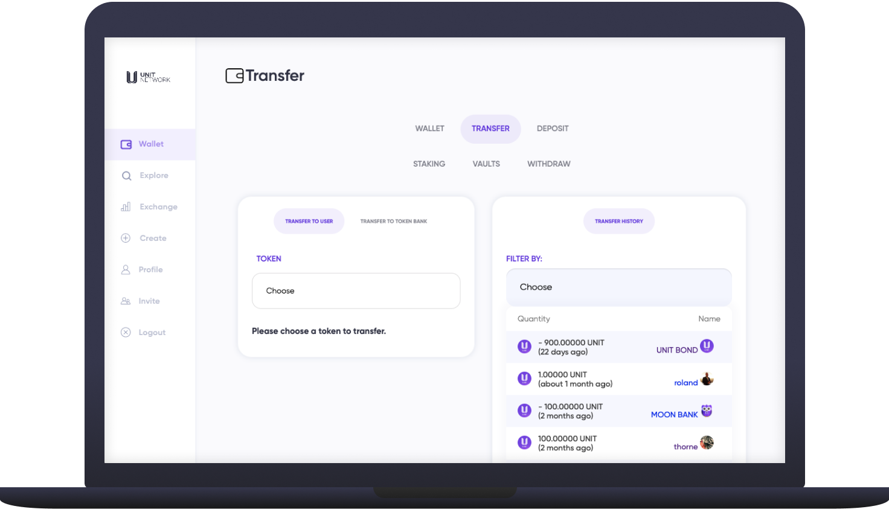

# ➡ Transfer

<figure><figcaption></figcaption></figure>

## Overview

The [Transfer](https://www.unit.network/wallet/transfer) tab allows you to transfer any tokens held in your [wallet](https://www.unit.network/wallet) to other user wallets or other token banks on Unit Network, currently it is not possible to transfer tokens outside of the Unit Network ecosystem, however the Blur Chip assets can be withdrawn to external crypto wallets.&#x20;


All transfers are made on a username basis and do not incur a network or gas fee


## How to transfer tokens to users

Transferring tokens to other user wallets on Unit Network is very simple and incurs no fees.&#x20;

<figure><figcaption></figcaption></figure>

1. From within the [wallet](https://www.unit.network/wallet) page select [transfer to user](https://www.unit.network/wallet/transfer?)
2. From the TOKEN dropdown list select the coin or token you'd like to transfer&#x20;
3. Choose the:
   * Quantity (Amount of tokens you'd like to transfer) or,
   * Total Amount (The dollar value of the tokens you'd like to transfer)
   * Username or email of the user you'd like to transfer to
4. Click 'transfer' and you'll see a notification prompt that the transfer was completed or failed due to an input error / lack of funds.

**Please note:** When transferring [user generated tokens ](../explore/launch-token.md)you will only see an option to transfer a quantity of tokens if the exchange isn't open and there is no price data. At present the transfer module doesn't automatically display the quantity of a specific token in your wallet but we are working to amend this.


Unsure if a transfer was completed successfully? Please see the 'transfer history' module as all transfer activity is recorded there.


## How to transfer tokens to a token bank

Transferring tokens to a token bank is a similar concept to transferring funds to a business bank account rather than a private account holder as is this case above.&#x20;

<figure><figcaption></figcaption></figure>

1. From within the [wallet](https://www.unit.network/wallet) page select [transfer to token bank](https://www.unit.network/wallet/transfer\_token?)
2. From the dropdown list select the coin or token you'd like to transfer&#x20;
3. Choose the:
   * Quantity (Amount of tokens you'd like to transfer) or,
   * Total Amount (The dollar value of the tokens you'd like to transfer)
   * Symbol (ticker) of the token you'd like to transfer to (e.g. UNIT, BTCU, MUSIC, THORNE)
4. Click 'transfer' and you'll see a notification prompt that the transfer was completed or failed due to an input error / lack of funds.

**Please note:** When transferring [user generated tokens ](../explore/launch-token.md)you will only see an option to transfer a quantity of tokens if the exchange isn't open and there is no price data. At present the transfer module doesn't automatically display the quantity of a specific token in your wallet but we are working to amend this.


Unsure if a transfer was completed successfully? Please see the 'transfer history' module as all transfer activity is recorded there.

